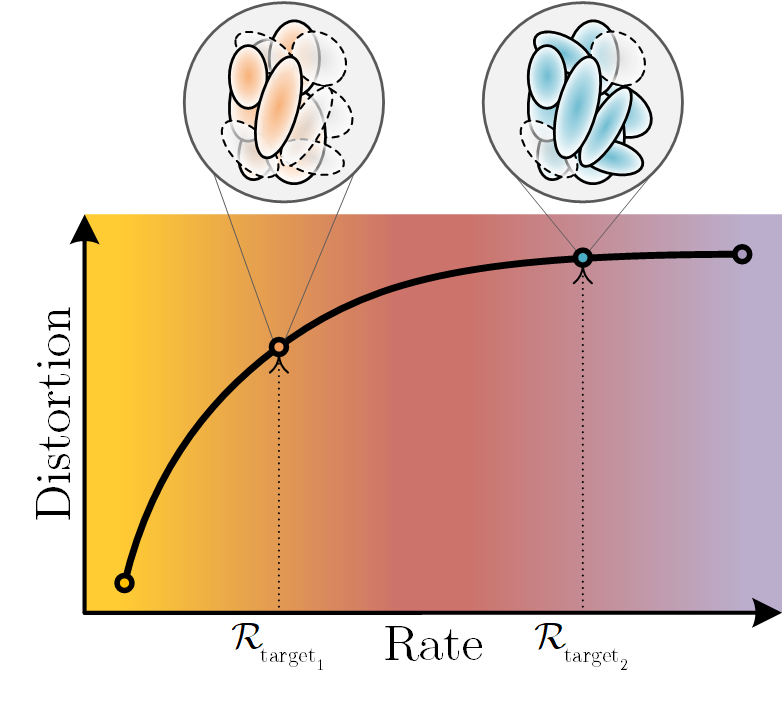

RAVE: Rate-Adaptive Visual Encoding for 3d Gaussian Splatting
------

<p align="center">
    
</p>

This repo contains the code of the paper
[**RAVE: Rate-Adaptive Visual Encoding for 3d Gaussian Splatting**](https://www.arxiv.org/abs/2512.07052).

## Usage

### Step 1: Train baseline single-rate model

<p align="center">
    
</p>

First, run [``scalable_train.py``](scalable_train.py) to train a baseline _single-rate_ Scaffold-GS model:

```cmd
python train.py --eval --source_path [dataset_path] --lod 0 --voxel_size 0.001 --appearance_dim 0 --ratio 1 -m [baseline_output_path]
```

Example commands can be found in [``commands.txt``](commands.txt).

### Step 2: Train progressive model

<p align="center">
    
</p>

Next, run [``scalable_train.py``](scalable_train.py) to train a multilevel (a.k.a. _progressive_) model starting from the weights
obtained from [step 1](#step-1-train-baseline-model):

```cmd
python scalable_train.py --eval --source_path [dataset_path] --pretrained_path [baseline_output_path] --lod 0 --voxel_size 0.001 --appearance_dim 0 --ratio 1 -m [multilevel_output_path] --G 5 --num_levels 8 --min 50000 --max 0.85 --compress --quantize --lambda_l1 0
```

Example commands can be found in [``commands.txt``](commands.txt).

### Step 3: Interpolate

<p align="center">
    
</p>

Finally, run [``scalable_interp.py``](scalable_interp.py) to obtain the continuous model using the output of
[step 2](#step-2-train-progressive-model).

```cmd
python scalable_interp.py --eval --source_path [dataset_path] --pretrained_path [multilevel_output_path] --lod 0 --voxel_size 0.001 --appearance_dim 0 --ratio 1 -m [interpolated_model_path] --G 5 --num_levels 8 --num_test_levels 50 --min 50000 --max 0.85 --compress --quantize --lambda_l1 0
```

Example commands can be found in [``interp_commands.txt``](interp_commands.txt).

## Citation

Feel free to use the code, and please cite our paper https://www.arxiv.org/abs/2512.07052:

```bibtex
@misc{tran2025rave,
    title={RAVE: Rate-Adaptive Visual Encoding for 3D Gaussian Splatting}, 
    author={Hoang-Nhat Tran and Francesco Di Sario and Gabriele Spadaro and Giuseppe Valenzise and Enzo Tartaglione},
    year={2025},
    eprint={2512.07052},
    archivePrefix={arXiv},
    primaryClass={cs.CV},
    url={https://arxiv.org/abs/2512.07052}, 
}
```

## License

MIT licensed. See [LICENSE.txt](LICENSE.txt).
