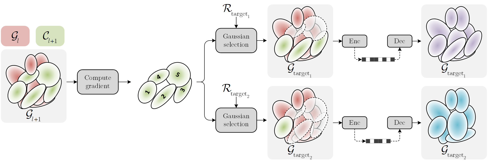
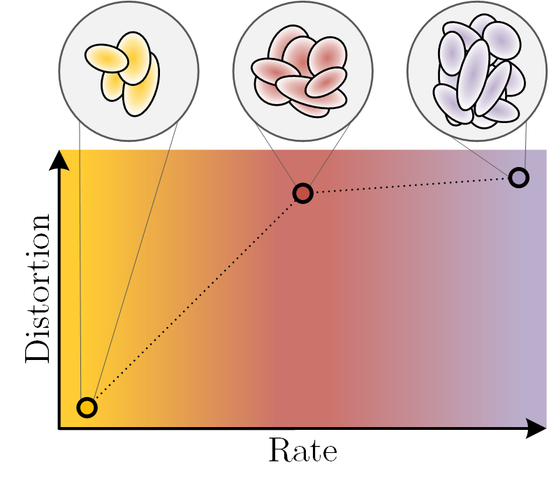
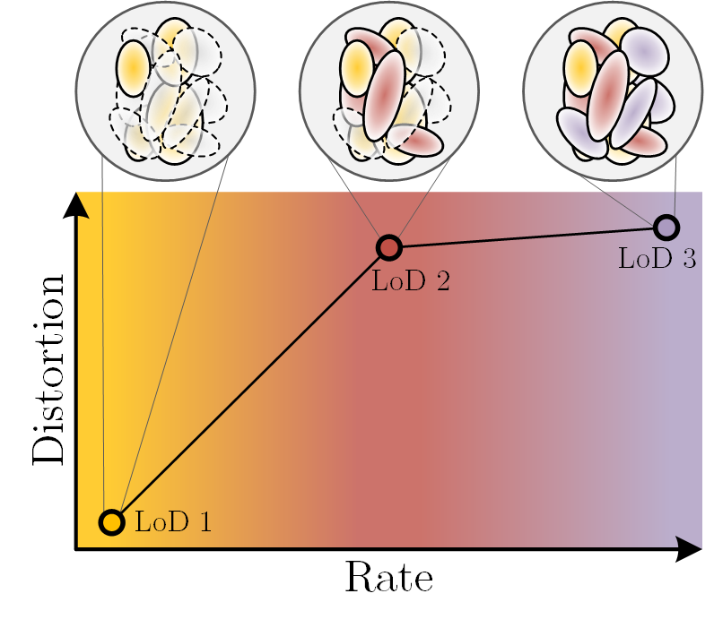
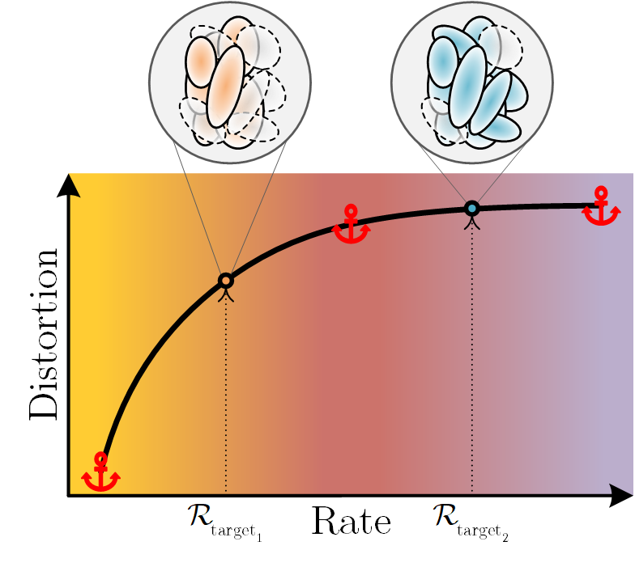

 RAVE: Rate-Adaptive Visual Encoding for 3D Gaussian Splatting [](https://www.arxiv.org/abs/2512.07052)
------
[Hoang-Nhat Tran](https://github.com/inspiros)\*,
[Francesco Di Sario](https://eidos.di.unito.it/author/francesco-di-sario/)\*,
[Gabriele Spadaro](https://eidos.di.unito.it/author/gabriele-spadaro/),
[Giuseppe Valenzise](https://scholar.google.com/citations?user=7ftDv4gAAAAJ),
[Enzo Tartaglione](https://enzotarta.github.io/)\
<sub>\*: Equal contribution</sub>

#### [🏠Project Page](https://rave-3dgs.github.io/) | [📝Paper](https://arxiv.org/pdf/2512.07052.pdf)

## Overview

<p align="center">
    
</p>

This repo contains the official implementation of the paper
[**RAVE: Rate-Adaptive Visual Encoding for 3d Gaussian Splatting**](https://www.arxiv.org/abs/2512.07052),
featuring the first continuous-rate Gaussian splats compression technique.

## Installation

### Dependencies

First clone this repo:

```
git clone https://github.com/inspiros/RAVE.git
cd RAVE
```

Then, unzip ``submodules/submodules.tar.gz`` and install the two required submodules using the
following command:

```cmd
pip install [path_to_submodule]
```

All other dependencies are inherited from the [Scaffold-GS](https://github.com/city-super/Scaffold-GS) repository.
We do not provide a SIBR viewer, but you can try your luck with existing ones.

### Data

Prepare the datasets according to the instructions of
[Scaffold-GS](https://github.com/city-super/Scaffold-GS).

## Usage

### Step 1: Train baseline single-rate model

<p align="center">
    
</p>

First, run [``scalable_train.py``](scalable_train.py) to train a baseline _single-rate_ Scaffold-GS model.
This step is optional if you already have the pre-trained models.

```cmd
python train.py --eval --source_path [dataset_path] --lod 0 --voxel_size 0.001 --appearance_dim 0 --ratio 1 -m [baseline_output_path]
```

### Step 2: Train progressive model

<p align="center">
    
</p>

Next, run [``scalable_train.py``](scalable_train.py) to train a scalable (a.k.a. _progressive_) model starting from the weights
obtained in [step 1](#step-1-train-baseline-model).
We adopt the procedure and hyperparameters in [GoDE](https://arxiv.org/abs/2501.13558),
which entails 30000 iterations of fine-tuning.

```cmd
python scalable_train.py --eval --source_path [dataset_path] --pretrained_path [baseline_output_path] --lod 0 --voxel_size 0.001 --appearance_dim 0 --ratio 1 -m [multilevel_output_path] --G 5 --num_levels 8 --min 50000 --max 0.85 --compress --quantize --lambda_l1 0
```

### Step 3: Interpolate from progressive anchors

<p align="center">
    
</p>

Finally, run [``scalable_interp.py``](scalable_interp.py) to obtain the continuous model by interpolating between the output anchors of
[step 2](#step-2-train-progressive-model).
This step is the main contribution of this work.

```cmd
python scalable_interp.py --eval --source_path [dataset_path] --pretrained_path [multilevel_output_path] --lod 0 --voxel_size 0.001 --appearance_dim 0 --ratio 1 -m [interpolated_model_path] --G 5 --num_levels 8 --num_test_levels 50 --min 50000 --max 0.85 --compress --quantize --lambda_l1 0
```

> [!NOTE]
> All the commands to reproduce experiments in the paper can be found in
> [``commands.txt``](commands.txt) and [``interp_commands.txt``](interp_commands.txt).
> 
> The script in [step 3](#step-3-interpolate-from-progressive-anchors) might seem to be slow but most of the
> execution time is dedicated to evaluation, which should be disabled if unnecessary.

## Contact

- Hoang-Nhat Tran: hoang-nhat.tran@unicaen.fr
- Francesco Di Sario: francesco.disario@edu.unito.it

## Citation and Acknowledgements

Feel free to use the code, and please cite [our paper](https://www.arxiv.org/abs/2512.07052):

```bibtex
@misc{tran2025rave,
  title         = {RAVE: Rate-Adaptive Visual Encoding for 3D Gaussian Splatting}, 
  author        = {Hoang-Nhat Tran and Francesco Di Sario and Gabriele Spadaro and Giuseppe Valenzise and Enzo Tartaglione},
  year          = {2025},
  eprint        = {2512.07052},
  archivePrefix = {arXiv},
  primaryClass  = {cs.CV},
  url           = {https://arxiv.org/abs/2512.07052}, 
}
```

This work is built upon [GoDE](https://arxiv.org/abs/2501.13558) - a scalable 3DGS compression technique, please cite:

```bibtex
@article{di2025gode,
  title   = {Gode: Gaussians on demand for progressive level of detail and scalable compression},
  author  = {Di Sario, Francesco and Renzulli, Riccardo and Grangetto, Marco and Sugimoto, Akihiro and Tartaglione, Enzo},
  journal = {arXiv preprint arXiv:2501.13558},
  year    = {2025}
}
```

## License

Please follow the license of [3D-GS](https://github.com/graphdeco-inria/gaussian-splatting/blob/main/LICENSE.md).
